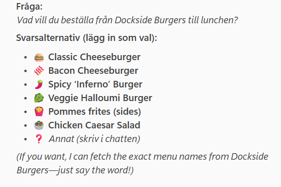
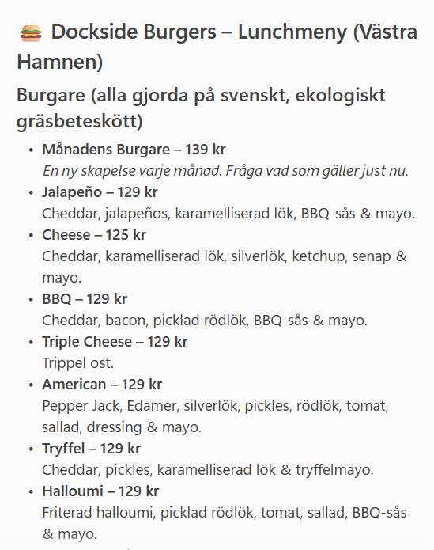

# 🎯 What are we aiming for? {background-color="#1b9e77"}

{fig-alt="Person meditating at desk with laptop"}

## To save time going from "What shall we have for lunch?" 🤔 to "Order placed." ✅

{fig-alt="Person meditating at desk with laptop smiling"}

# 🤖 What shall we try first? {background-color="#d95f02"}

## Just ask Copilot in MS Teams

{fig-alt="Screenshot of MS Teams Copilot interface"}

## Hmm, it can't create the poll... 😬

{fig-alt="Screenshot of MS Teams Copilot interface with lunch suggestions"}

## But it can find the menu, right? 🧐

{fig-alt="Screenshot of MS Teams Copilot interface with menu suggestions"}


## But it can find the menu, RIGHT? 😰

{fig-alt="Screenshot of MS Teams Copilot interface with menu suggestions"}

## Wrong! 🚫

The lunch menu has a smaller selection of burgers, and all go for 125 SEK.

```{r}
knitr::include_url("https://malmo.docksideburgers.se/lunchmeny/", height = "500px")

```

# 😞 So, Copilot in MS Teams can't help us with lunch decisions yet. {background-color="#7570b3"}


# 💡 What could we do instead? {background-color="#e7298a"}

## Deterministic approach? 🔧

### We could write a scraper to visit the restaurant websites, and extract the menu information from there.

## Where does this solution fail? 💥

The website menus are quite varied, for example, 

::: {.incremental}

- Dockside's menu is a PDF that updates monthly

- Holy Greens' menu is a javascript page that shows available options and prices per restaurant location

- Reka's Burgers menu is a static HTML page that hasn't changed since last year

- **We could write custom scrapers for each restaurant, but that would be a lot of work, and would break easily if the website changes.**

:::


## So, let's try giving the system more agency to achieve specific goals 🚀

Follow along on Github at [github.com/j-jayes/literate-broccoli](https://github.com/j-jayes/literate-broccoli)

::: footer

:::


# 🛤️ The Road to a Working Solution {background-color="#1b9e77"}

## 🍔 Demo: Web App {background-gradient="linear-gradient(135deg, #190878 0%, #5a1ea0 52%, #aa4bf5 100%)"}

::: {.inverse-block}
**Let's see the web app in action.**

Search for a restaurant, review the menu, create a poll, and place orders — all powered by the agentic scraper.
:::

## 🤖 Demo: Copilot Studio Agent {background-gradient="linear-gradient(135deg, #190878 0%, #5a1ea0 52%, #aa4bf5 100%)"}

::: {.inverse-block}
**Same MCP tool, different client.**

The Copilot Studio agent calls the exact same scraper — proving the value of MCP: build once, connect everywhere.
:::

::: {.notes}
Switch to Copilot Studio and show the same restaurant query. The point is that the tool code didn't change at all — only the client changed. This is the MCP value proposition in action.
:::


# 🕷️ How Does the Scraper Work? {background-color="#d95f02"}

## 🧠 An LLM That Browses Like You Do {.section-slide}

## Traditional Scraper vs. Agentic Scraper ⚔️

:::: {.columns}
::: {.column width="48%"}
### Traditional

- Hardcoded URL per restaurant
- CSS or XPath selectors
- Breaks when the site changes
- One script per restaurant
:::

::: {.column width="48%"}
### Agentic

- Starts from homepage or web search
- LLM reads the page and decides what to do
- Follows links to find the menu
- **Same code for every restaurant**
:::
::::

## Eight Steps to Find Any Menu 🗺️

```{mermaid}
flowchart TD
    Start("Start URL or search") --> Fetch("Fetch page")
    Fetch --> LLM("LLM reads page + links")
    LLM -->|"extract"| Done("Return menu items")
    LLM -->|"navigate"| Nav("Follow a link")
    Nav --> Fetch
    LLM -->|"search"| Search("Web search via Gemini")
    Search --> Fetch
    LLM -->|"fail"| Error("Raise error")
```

::: {.notes}
MAX_STEPS = 8 prevents infinite loops. Gemini handles the web search grounding, GPT-4o makes the navigation decisions. The LLM gets a text preview of the page plus all links and decides what action to take at each step.
:::

## Four Actions, One Decision Model 🎯

```python
MAX_STEPS = 8

class BrowseDecision(BaseModel):
    action: str   # "extract", "navigate", "search", "fail"
    reason: str
    url: Optional[str] = None    # for "navigate"
    query: Optional[str] = None  # for "search"
```

::: {.notes}
The action vocabulary is deliberately small — four verbs cover all navigation scenarios. The reason field is invaluable for debugging: you can see exactly why the LLM chose to navigate or extract at each step.
:::

## Pydantic Guarantees the Output Shape 🔒

:::: {.columns}
::: {.column width="52%"}
```python
class MenuCategory(str, Enum):
    main = "main"
    side = "side"
    drink = "drink"
    dessert = "dessert"
    other = "other"

class ExtractedMenuItem(BaseModel):
    name: str
    price: Optional[Decimal] = None
    category: MenuCategory
    description: Optional[str] = None
```
:::

::: {.column width="48%"}
::: {.incremental}

- LLM output validated automatically
- Categories enforce consistent grouping
- Frontend can rely on the shape
- Adding a restaurant = zero code changes
- Price normalization handles "125:-", "125 kr", "125 SEK"

:::
:::
::::

## When Things Go Wrong 🛡️

:::: {.columns}
::: {.column width="48%"}
### LLM provider fallback

```{mermaid}
flowchart TD
    A("Azure OpenAI") -->|"fails"| B("OpenAI")
    B -->|"fails"| C("Google Gemini")
    style A fill:#190878,color:#fff
```

If one provider is down or rate-limited, the next one picks up automatically.
:::

::: {.column width="48%"}
### Scraper resilience

::: {.incremental}

- 403 Forbidden? Falls back to web search
- PDF menu? Extracts text with PyMuPDF
- Wrong page? LLM navigates away
- Infinite loop? MAX_STEPS = 8 stops it
- No menu found? Returns a clear error

:::
:::
::::

::: {.notes}
This is what makes it production-ready. The LLM provider chain tries Azure OpenAI first, then falls back to OpenAI, then Gemini. The scraper itself handles hostile websites gracefully — if it gets blocked, it searches the web for an alternative URL. If it lands on the wrong page, the LLM recognises that and navigates elsewhere.
:::

# 🔌 What is MCP? {background-color="#7570b3"}

## 🔌 USB-C for AI Applications {.section-slide}

## MCP Connects AI Apps to Tools and Data 🌐

::: {.lede}
Model Context Protocol is an open standard that lets any AI client call any tool through a shared interface — like USB-C for AI.
:::

```{mermaid}
flowchart LR
    H("AI App - Host") --> C("MCP Client")
    C --> S("MCP Server")
    S --> T("Tools")
    S --> D("Data Sources")
```

<!-- IMAGE: You can replace this mermaid with a screenshot from modelcontextprotocol.io showing their architecture diagram. Save to assets/screenshots/mcp-architecture.png and use:  -->

::: {.notes}
MCP was created by Anthropic and open-sourced. Think of it like USB-C: you define your tool once, expose it over HTTP or stdio, and any MCP-compatible client can use it. No custom integration per client.
:::

## FastMCP Makes It Trivial ⚡

:::: {.columns}
::: {.column width="55%"}
```python
from fastmcp import FastMCP
from src.tools.menu import get_restaurant_menu

mcp = FastMCP("lunch-menu-poll")

@mcp.tool
async def get_menu_poll(
    restaurant_name: str,
    menu_url: str = "",
) -> dict:
    """Fetch a restaurant's menu and
    return an Adaptive Card poll."""
    return await get_restaurant_menu(
        restaurant_name,
        menu_url=menu_url or None,
    )

app = mcp.http_app()
```
:::

::: {.column width="45%"}
::: {.metric-card}
<span class="metric-value">23.5k</span>
<span class="metric-label">GitHub stars</span>
:::

::: {.metric-card}
<span class="metric-value">70%</span>
<span class="metric-label">of MCP servers use FastMCP</span>
:::
:::
::::

<!-- IMAGE: You can add a FastMCP GitHub screenshot here. Save to assets/screenshots/fastmcp-github.png -->

::: {.notes}
This is the entire MCP server. FastMCP handles protocol negotiation, schema generation from type hints, and HTTP transport. The @mcp.tool decorator is all you need. The docstring becomes the tool description that LLMs see when deciding whether to call it.
:::

## What Does FastMCP Do For You? 🪄

```{mermaid}
flowchart LR
    F("Your Python Function") --> D("@mcp.tool")
    D --> S("JSON Schema from type hints")
    D --> V("Input validation via Pydantic")
    D --> Doc("Tool description from docstring")
    D --> T("HTTP + stdio transport")
    style D fill:#190878,color:#fff
```

::: {.incremental}

- You write a normal Python function with type hints
- FastMCP generates the JSON schema, validates inputs, and handles transport
- The docstring becomes the tool description that LLMs read when deciding to call it
- Run over stdio for local clients or HTTP for remote ones

:::

::: {.notes}
The key insight is that FastMCP turns your regular Python function into a protocol-compliant tool. You don't write any JSON Schema, you don't handle HTTP requests, you don't parse arguments. You just write a function.
:::

## FastAPI vs. FastMCP: Spot the Difference 🔍

:::: {.columns}
::: {.column width="48%"}
### FastAPI endpoint

```python
from fastapi import FastAPI

app = FastAPI()

@app.post("/menu")
async def get_menu(
    restaurant_name: str,
    menu_url: str = "",
) -> dict:
    """Fetch a restaurant menu."""
    return await get_restaurant_menu(
        restaurant_name,
        menu_url=menu_url or None,
    )
```

Called by: **your frontend code**
:::

::: {.column width="48%"}
### FastMCP tool

```python
from fastmcp import FastMCP

mcp = FastMCP("lunch-menu-poll")

@mcp.tool
async def get_menu(
    restaurant_name: str,
    menu_url: str = "",
) -> dict:
    """Fetch a restaurant menu."""
    return await get_restaurant_menu(
        restaurant_name,
        menu_url=menu_url or None,
    )
```

Called by: **any LLM client**
:::
::::

::: {.accent-panel}
Same function, same types, same docstring — but now any AI app can discover and call it.
:::

::: {.notes}
This slide is the "aha" moment. If you already know FastAPI, you basically already know FastMCP. The decorator changes from @app.post to @mcp.tool, the framework changes from FastAPI to FastMCP, but the function body is identical. The difference is who calls it: with FastAPI, your frontend makes HTTP requests. With FastMCP, any MCP-compatible LLM client — Claude, ChatGPT, Copilot Studio — can discover the tool and call it autonomously.
:::

## One Codebase, Three Front Doors

```{mermaid}
flowchart TB
    subgraph Consumers
        CS("Copilot Studio")
        TB("Teams Bot")
        WA("Web App")
    end
    subgraph MCP
        Tool("get_menu_poll")
    end
    subgraph Scraper
        Browse("browse_and_extract")
        Extract("extract_menu")
        Models("Pydantic models")
    end
    CS --> Tool
    TB --> Tool
    WA --> Tool
    Tool --> Browse
    Browse --> Extract
    Extract --> Models
```

::: {.notes}
This is the full architecture. All three consumers call the same MCP tool. The scraper handles the browsing, extraction, and validation. Improve the scraper once, and Copilot Studio, the Teams bot, and the web app all benefit.
:::

# 📦 Shipping It {background-color="#e7298a"}

## One Dockerfile, From Code to Cloud 🐳

:::: {.columns}
::: {.column width="52%"}
```dockerfile
# Stage 1: Build React frontend
FROM node:20-alpine AS frontend-build
COPY lunch-web-app/frontend/ ./
RUN npm ci && npm run build

# Stage 2: Python backend + static files
FROM python:3.12-slim
COPY --from=ghcr.io/astral-sh/uv:0.7.3 /uv /uvx /bin/
COPY pyproject.toml ./
RUN uv pip install --system .
COPY lunch-web-app/backend/ ./backend/
COPY --from=frontend-build /dist ./frontend/dist

CMD ["uvicorn", "backend.main:app",
     "--host", "0.0.0.0", "--port", "8000"]
```
:::

::: {.column width="48%"}
::: {.incremental}

- Multi-stage build: Node for frontend, Python for backend
- Final image has no Node.js — just Python + static files
- Push to Azure Container Registry
- Azure Container Apps handles scaling and TLS
- Environment variables for API keys via secrets

:::
:::
::::

::: {.notes}
The multi-stage Dockerfile builds the React frontend with Node, then copies the compiled static files into a slim Python image. The final image is small and only runs uvicorn. Azure Container Apps gives us managed scaling, TLS, and secret management with zero infrastructure to maintain.
:::

# 🎓 What Did We Learn? {background-color="#1b9e77"}

## Three Ideas to Take With You 💡

:::: {.columns}
::: {.column width="33%"}
::: {.metric-card}
<span class="metric-value">Agency</span>
<span class="metric-label">Let LLMs navigate, not just parse</span>
:::
:::

::: {.column width="33%"}
::: {.metric-card}
<span class="metric-value">MCP</span>
<span class="metric-label">Build once, connect everywhere</span>
:::
:::

::: {.column width="33%"}
::: {.metric-card}
<span class="metric-value">Pydantic</span>
<span class="metric-label">Structured outputs you can trust</span>
:::
:::
::::

## Thank You — Questions? 🙏

Follow along on Github at [github.com/j-jayes/literate-broccoli](https://github.com/j-jayes/literate-broccoli)

::: footer

:::

## CLOSING SLIDE {footer=false}

::: {.closing-mark}
{fig-alt="Nexer symbol"}
:::

### CTL + ALT + DELISH

Built with FastMCP, FastAPI, and React.

# Appendix{background-color="#d95f02"}


## Copilot Studio: Great for 1:1, Not for Group Polls 🙅{visibility="uncounted"}

:::: {.columns}
::: {.column width="55%"}
::: {.incremental}

- Built a Copilot Studio agent with MCP tool access
- Works perfectly in a 1:1 conversation
- Can search for menus, extract items, show results
- **Cannot create a poll in a group chat**
- Lunch ordering is collaborative!

:::
:::

::: {.column width="45%"}
```{mermaid}
flowchart LR
    U("User") --> CS("Copilot Studio")
    CS --> MCP("MCP Scraper")
    CS -.->|"Cannot"| GP("Group Poll")
    style GP stroke:#ff5028,stroke-dasharray: 5 5
```
:::
::::

::: {.notes}
The Copilot Studio agent was good at the search and menu extraction part. But since it only talks 1:1, it couldn't collect orders from the whole team. That's a fundamental architecture limitation.
:::

## Three Attempts, One Scraper 🔄{visibility="uncounted"}

```{mermaid}
flowchart LR
    CS("Copilot Studio") --> S("MCP Scraper")
    TB("Teams Bot") --> S
    WA("Web App") --> S
    style S fill:#190878,color:#fff
```

::: {.accent-panel}
The Teams bot is not yet IT-approved — so today we demo the web app. But the scraper powering all three is identical.
:::

::: {.notes}
The key takeaway here is that we wrote the scraper once as an MCP tool, and all three front-ends consume the same code. When we improve the scraper, all consumers benefit.
:::
