# 🎯 What are we aiming for? {background-color="#1b9e77"}

{fig-alt="Person meditating at desk with laptop"}

## To save time going from "What shall we have for lunch?" 🤔 to "Order placed." ✅

{fig-alt="Person meditating at desk with laptop smiling"}

# 🤖 What shall we try first? {background-color="#d95f02"}

## Just ask Copilot in MS Teams

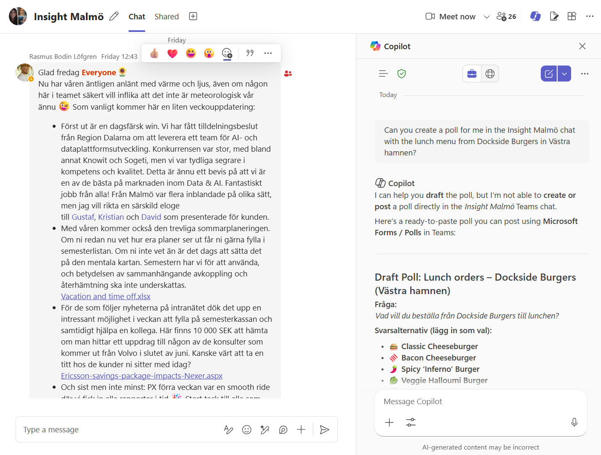{fig-alt="Screenshot of MS Teams Copilot interface"}

## Hmm, it can't create the poll... 😬

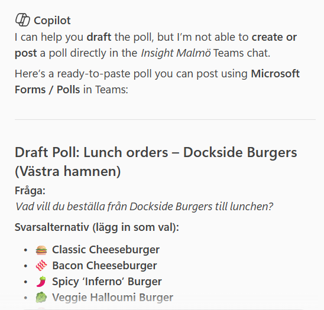{fig-alt="Screenshot of MS Teams Copilot interface with lunch suggestions"}

## But it can find the menu, right? 🧐

{fig-alt="Screenshot of MS Teams Copilot interface with menu suggestions"}


## But it can find the menu, RIGHT? 😰

{fig-alt="Screenshot of MS Teams Copilot interface with menu suggestions"}

## Wrong! 🚫

The lunch menu has a smaller selection of burgers, and all go for 125 SEK.

```{r}
knitr::include_url("https://malmo.docksideburgers.se/lunchmeny/", height = "500px")

```

# 😞 So, Copilot in MS Teams can't help us with lunch decisions yet. {background-color="#7570b3"}

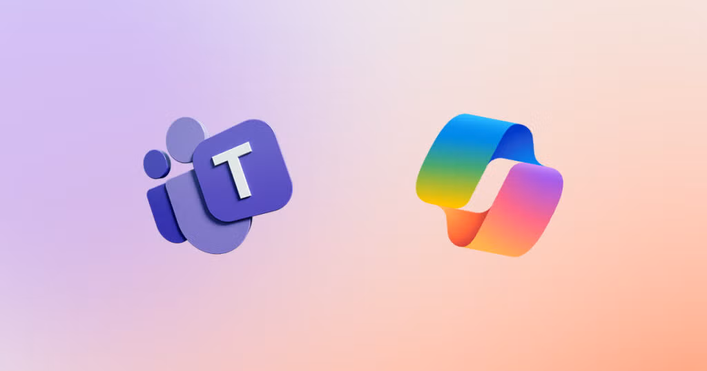

# 💡 What could we do instead? {background-color="#e7298a"}

## Deterministic approach? 🔧

### We could write a scraper to visit the restaurant websites, and extract the menu information from there.

## Where does this solution fail? 💥

The website menus are quite varied, for example,

::: {.incremental}

- Dockside's menu is a PDF that updates monthly

- Holy Greens' menu is a javascript page that shows available options and prices per restaurant location

- Reka's Burgers menu is a static HTML page that hasn't changed since last year

- **We could write custom scrapers for each restaurant, but that would be a lot of work, and would break easily if the website changes.**

:::


## So, let's try giving the system more agency to achieve specific goals 🚀

Follow along on GitHub at [github.com/j-jayes/literate-broccoli](https://github.com/j-jayes/literate-broccoli)

::: footer

:::


# 🛤️ The Road to a Working Solution {background-color="#1b9e77"}

# 📱 The App in Action {background-color="#d95f02"}

## Step 1 — Sign In

The admin authenticates with a shared team password before accessing the ordering panel.

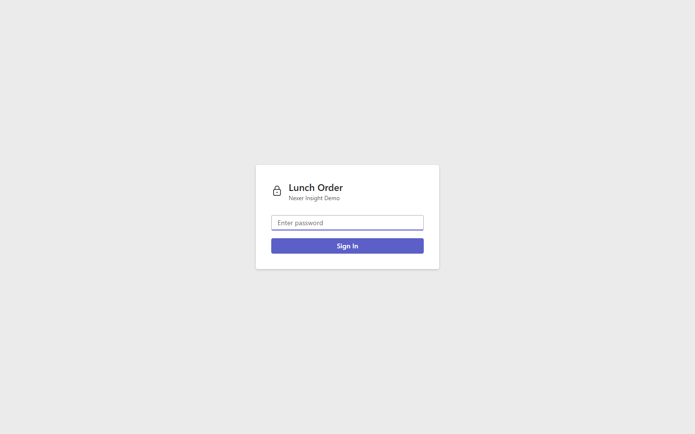{fig-alt="Login screen" width="80%"}

## Step 2 — Select Today's Restaurants

Pre-scraped menus load instantly. The admin picks which restaurants to include in today's poll.

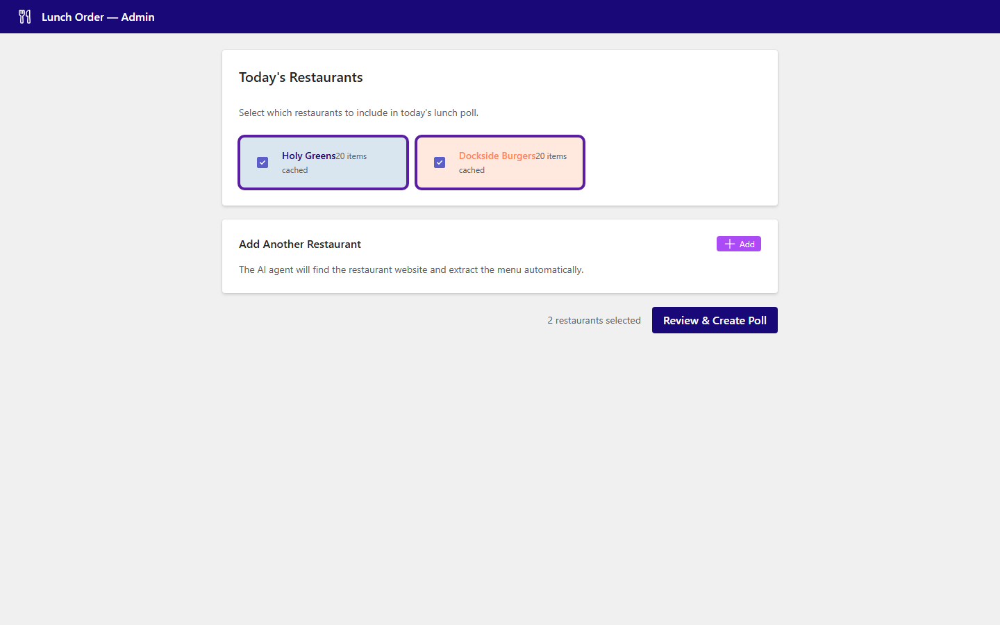{fig-alt="Admin panel showing cached restaurants" width="80%"}

## Step 3 — Add a New Restaurant (optional)

The AI agent can browse any restaurant website on demand and extract the menu automatically.

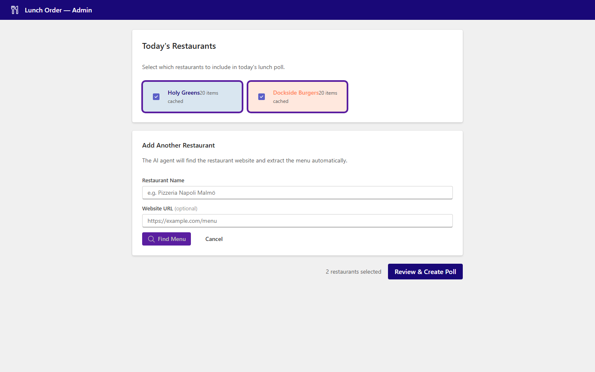{fig-alt="Add restaurant form" width="80%"}

## Step 4 — Review & Trim the Menu

The admin can deselect items before publishing — useful for removing sold-out or seasonal dishes.

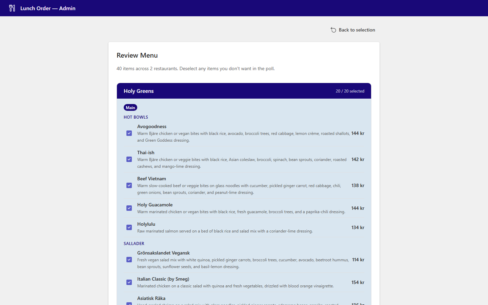{fig-alt="Menu review page" width="80%"}

## Step 5 — Create the Poll

One click creates a shareable link. The session is live immediately.

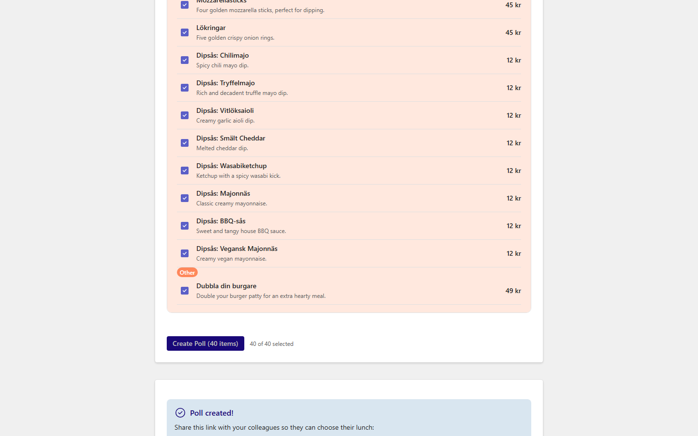{fig-alt="Poll created with shareable link" width="80%"}

## Step 6 — Team Members Open the Link

Anyone with the link can see the full menu and check off what they want.

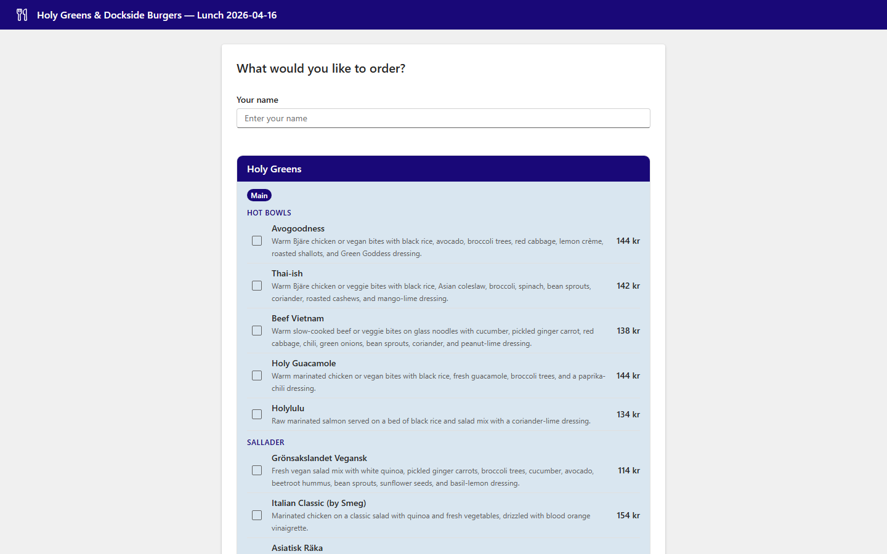{fig-alt="Poll page for team members" width="80%"}

## Step 7 — Select Items and Submit

Name, tick items, done. Orders arrive in real time on the admin's screen.

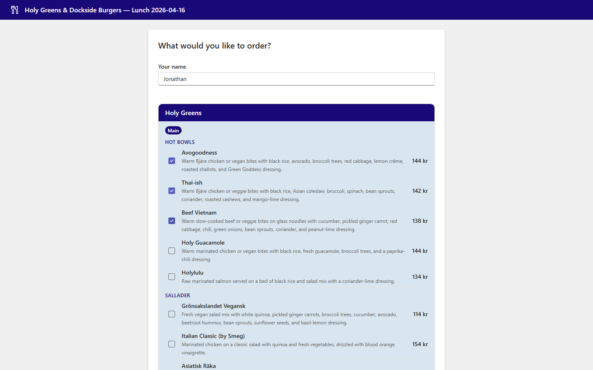{fig-alt="Order selection with items checked" width="80%"}

## Step 8 — Live Order Feed

Submitted orders appear instantly. The admin sees a running tally as the team orders.

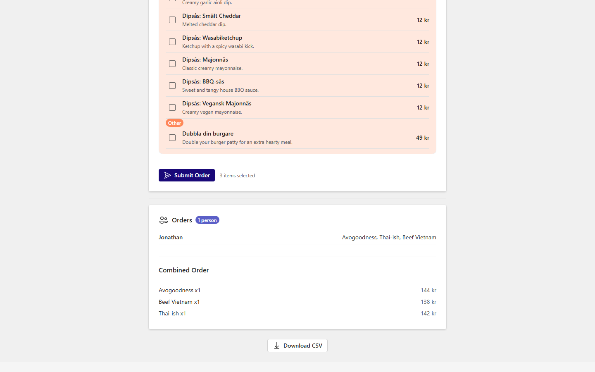{fig-alt="Live order list showing submitted orders" width="80%"}


# 🏗️ System Architecture {background-color="#7570b3"}

## High-Level Overview

```{mermaid}
flowchart TB
    subgraph Users["👥 Users"]
        Admin("Admin\nbrowser")
        Team("Team\nbrowsers")
    end

    subgraph App["🐳 Azure Container App"]
        React("React\nfrontend")
        FastAPI("FastAPI\nbackend")
        Scraper("Agentic\nscraper")
        Cache("Cached\nmenus.py")
    end

    subgraph LLMs["🧠 LLM Providers"]
        AzOAI("Azure\nOpenAI")
        OAI("OpenAI")
        Gemini("Google\nGemini")
    end

    subgraph CI["⚙️ GitHub Actions"]
        Scrape("Monthly\nscraper job")
        Deploy("Build &\ndeploy job")
    end

    subgraph Azure["☁️ Azure"]
        ACR("Container\nRegistry")
        Storage("Blob\nStorage")
    end

    Admin -->|HTTPS| React
    Team -->|HTTPS| React
    React -->|REST API| FastAPI
    FastAPI --> Scraper
    FastAPI --> Cache
    Scraper -->|fallback chain| AzOAI
    AzOAI -->|fails| OAI
    OAI -->|fails| Gemini
    FastAPI -->|sessions| Storage
    Scrape -->|refreshes| Cache
    Deploy -->|pushes image| ACR
    ACR -->|pulls| App
```

## Scraper Subsystem

```{mermaid}
flowchart TD
    Start("Restaurant name\nor URL") --> Fetch("Fetch page")
    Fetch --> LLM("LLM reads page\n+ all links")
    LLM -->|extract| Done("Return\nMenuItems")
    LLM -->|navigate| Nav("Follow link")
    Nav --> Fetch
    LLM -->|search| Search("Gemini web\ngrounding")
    Search --> Fetch
    LLM -->|fail| Error("Return error")

    style Done fill:#1b9e77,color:#fff
    style Error fill:#d95f02,color:#fff
    style LLM fill:#190878,color:#fff
```

::: {.notes}
MAX_STEPS = 8 prevents infinite loops. At each step the LLM sees the page text and all links and picks one of four actions. The reason field in every decision is invaluable for debugging.
:::

## Session & Ordering Subsystem

```{mermaid}
sequenceDiagram
    participant Admin
    participant Backend
    participant Storage
    participant Team

    Admin->>Backend: POST /api/sessions {restaurants}
    Backend->>Storage: write session JSON
    Backend-->>Admin: {id, url}

    Admin->>Team: shares /session/{id} link

    Team->>Backend: GET /api/sessions/{id}
    Backend->>Storage: read session
    Backend-->>Team: menu items

    Team->>Backend: POST /sessions/{id}/orders {name, items}
    Backend->>Storage: append order
    Backend-->>Team: updated session (SSE push)
    Backend-->>Admin: SSE update
```

## Deployment Pipeline

```{mermaid}
flowchart LR
    subgraph GH["GitHub"]
        Push("git push\nmain") --> CI("CI: compile\ncheck")
        Sched("Cron 3rd\nof month") --> Scrape("Scrape &\ncompare")
        Scrape -->|menus changed| Build
    end

    subgraph Azure["Azure"]
        Build("Docker\nbuild") --> ACR("Push image\nto ACR")
        ACR --> Update("Update\nContainer App")
        Update --> Live("Live\nrevision")
    end

    style Live fill:#1b9e77,color:#fff
```

# 🕷️ How Does the Scraper Work? {background-color="#d95f02"}

## 🧠 An LLM That Browses Like You Do {.section-slide}

## Traditional Scraper vs. Agentic Scraper ⚔️

:::: {.columns}
::: {.column width="48%"}
### Traditional

- Hardcoded URL per restaurant
- CSS or XPath selectors
- Breaks when the site changes
- One script per restaurant
:::

::: {.column width="48%"}
### Agentic

- Starts from homepage or web search
- LLM reads the page and decides what to do
- Follows links to find the menu
- **Same code for every restaurant**
:::
::::

## Four Actions, One Decision Model 🎯

```python
MAX_STEPS = 8

class BrowseDecision(BaseModel):
    action: str   # "extract", "navigate", "search", "fail"
    reason: str
    url: Optional[str] = None    # for "navigate"
    query: Optional[str] = None  # for "search"
```

::: {.notes}
The action vocabulary is deliberately small — four verbs cover all navigation scenarios. The reason field is invaluable for debugging: you can see exactly why the LLM chose to navigate or extract at each step.
:::

## Pydantic Guarantees the Output Shape 🔒

:::: {.columns}
::: {.column width="52%"}
```python
class MenuCategory(str, Enum):
    main = "main"
    side = "side"
    drink = "drink"
    dessert = "dessert"
    other = "other"

class ExtractedMenuItem(BaseModel):
    name: str
    price: Optional[Decimal] = None
    category: MenuCategory
    description: Optional[str] = None
```
:::

::: {.column width="48%"}
::: {.incremental}

- LLM output validated automatically
- Categories enforce consistent grouping
- Frontend can rely on the shape
- Adding a restaurant = zero code changes
- Price normalization handles "125:-", "125 kr", "125 SEK"

:::
:::
::::

## When Things Go Wrong 🛡️

:::: {.columns}
::: {.column width="48%"}
### LLM provider fallback

```{mermaid}
flowchart TD
    A("Azure OpenAI") -->|"fails"| B("OpenAI")
    B -->|"fails"| C("Google Gemini")
    style A fill:#190878,color:#fff
```

If one provider is down or rate-limited, the next one picks up automatically.
:::

::: {.column width="48%"}
### Scraper resilience

::: {.incremental}

- 403 Forbidden? Falls back to web search
- PDF menu? Extracts text with PyMuPDF
- Wrong page? LLM navigates away
- Infinite loop? MAX_STEPS = 8 stops it
- No menu found? Returns a clear error

:::
:::
::::

# 🔌 What is MCP? {background-color="#7570b3"}

## 🔌 USB-C for AI Applications {.section-slide}

## MCP Connects AI Apps to Tools and Data 🌐

::: {.lede}
Model Context Protocol is an open standard that lets any AI client call any tool through a shared interface — like USB-C for AI.
:::

```{mermaid}
flowchart LR
    H("AI App - Host") --> C("MCP Client")
    C --> S("MCP Server")
    S --> T("Tools")
    S --> D("Data Sources")
```

::: {.notes}
MCP was created by Anthropic and open-sourced. Think of it like USB-C: you define your tool once, expose it over HTTP or stdio, and any MCP-compatible client can use it. No custom integration per client.
:::

## FastAPI vs. FastMCP: Spot the Difference 🔍

:::: {.columns}
::: {.column width="48%"}
### FastAPI endpoint

```python
from fastapi import FastAPI

app = FastAPI()

@app.post("/menu")
async def get_menu(
    restaurant_name: str,
    menu_url: str = "",
) -> dict:
    """Fetch a restaurant menu."""
    return await get_restaurant_menu(
        restaurant_name,
        menu_url=menu_url or None,
    )
```

Called by: **your frontend code**
:::

::: {.column width="48%"}
### FastMCP tool

```python
from fastmcp import FastMCP

mcp = FastMCP("lunch-menu-poll")

@mcp.tool
async def get_menu(
    restaurant_name: str,
    menu_url: str = "",
) -> dict:
    """Fetch a restaurant menu."""
    return await get_restaurant_menu(
        restaurant_name,
        menu_url=menu_url or None,
    )
```

Called by: **any LLM client**
:::
::::

::: {.accent-panel}
Same function, same types, same docstring — but now any AI app can discover and call it.
:::

## One Codebase, Three Front Doors

```{mermaid}
flowchart TB
    subgraph Consumers
        CS("Copilot Studio")
        TB("Teams Bot")
        WA("Web App")
    end
    subgraph MCP
        Tool("get_menu_poll")
    end
    subgraph Scraper
        Browse("browse_and_extract")
        Extract("extract_menu")
        Models("Pydantic models")
    end
    CS --> Tool
    TB --> Tool
    WA --> Tool
    Tool --> Browse
    Browse --> Extract
    Extract --> Models
```

# 📊 Monitoring & Operations {background-color="#1b9e77"}

## What We Have Today

:::: {.columns}
::: {.column width="50%"}
### Observability

::: {.incremental}
- **Log Analytics workspace** — all container logs streamed automatically
- **GitHub Issues** — monthly scrape report with per-restaurant diffs
- **Container App revision history** — easy rollback to any previous image
- **Health endpoint** — `GET /api/health` returns `{"status": "ok"}`
:::
:::

::: {.column width="50%"}
### Operational hygiene

::: {.incremental}
- `[skip ci]` on menu commits — prevents CI loops
- Concurrency lock on scraper job — no overlapping runs
- LLM fallback chain — survives single provider outages
- `uv.lock` — reproducible dependency snapshots across CI and Docker
:::
:::
::::

## What's Missing for True Production

```{mermaid}
flowchart LR
    subgraph Now["✅ Today"]
        Logs("Log Analytics")
        Issues("GitHub Issues")
        Health("Health endpoint")
    end

    subgraph Soon["🔜 Next steps"]
        Alerts("Azure Monitor\nalerts")
        Dash("App Insights\ndashboard")
        SLA("Uptime\nchecks")
    end

    subgraph Later["📅 Later"]
        Audit("Audit log\n(who ordered what)")
        Cost("Cost tracking\nper run")
        Rate("Rate limiting\n& auth hardening")
    end
```

# 🚀 Next Steps to Production {background-color="#d95f02"}

## Three Priority Tracks

:::: {.columns}
::: {.column width="33%"}
::: {.metric-card}
<span class="metric-value">Auth</span>
<span class="metric-label">Replace shared password with Azure AD / Teams SSO</span>
:::
:::

::: {.column width="33%"}
::: {.metric-card}
<span class="metric-value">Scale</span>
<span class="metric-label">Persistent session storage — Blob today, Cosmos DB at scale</span>
:::
:::

::: {.column width="33%"}
::: {.metric-card}
<span class="metric-value">UX</span>
<span class="metric-label">Teams bot IT approval — same MCP tool, richer surface</span>
:::
:::
::::

## Production Readiness Checklist

::: {.incremental}

- ☐ **Azure AD authentication** — replace shared password with Entra ID SSO; every order linked to a real user identity
- ☐ **Teams bot IT approval** — same scraper, natively in the tool your team already uses
- ☐ **Application Insights** — traces per scrape run, latency histograms, alert on error rate spikes
- ☐ **Azure Monitor alert** — ping if container restarts or scraper job fails
- ☐ **Cosmos DB** — sessions survive container restarts; current in-memory store does not
- ☐ **Uptime check** — external ping every 5 min; auto-restart on failure
- ☐ **Multi-restaurant support** — the data model already supports it; just need more entries in `restaurants.yml`

:::

# 🎓 What Did We Learn? {background-color="#1b9e77"}

## Three Ideas to Take With You 💡

:::: {.columns}
::: {.column width="33%"}
::: {.metric-card}
<span class="metric-value">Agency</span>
<span class="metric-label">Let LLMs navigate, not just parse</span>
:::
:::

::: {.column width="33%"}
::: {.metric-card}
<span class="metric-value">MCP</span>
<span class="metric-label">Build once, connect everywhere</span>
:::
:::

::: {.column width="33%"}
::: {.metric-card}
<span class="metric-value">Pydantic</span>
<span class="metric-label">Structured outputs you can trust</span>
:::
:::
::::

## Thank You — Questions? 🙏

Follow along on GitHub at [github.com/j-jayes/literate-broccoli](https://github.com/j-jayes/literate-broccoli)

::: footer

:::

## CLOSING SLIDE {footer=false}

::: {.closing-mark}
{fig-alt="Nexer symbol"}
:::

### CTL + ALT + DELISH

Built with FastMCP, FastAPI, and React.

# Appendix {background-color="#d95f02"}


## Copilot Studio: Great for 1:1, Not for Group Polls 🙅 {visibility="uncounted"}

:::: {.columns}
::: {.column width="55%"}
::: {.incremental}

- Built a Copilot Studio agent with MCP tool access
- Works perfectly in a 1:1 conversation
- Can search for menus, extract items, show results
- **Cannot create a poll in a group chat**
- Lunch ordering is collaborative!

:::
:::

::: {.column width="45%"}
```{mermaid}
flowchart LR
    U("User") --> CS("Copilot Studio")
    CS --> MCP("MCP Scraper")
    CS -.->|"Cannot"| GP("Group Poll")
    style GP stroke:#ff5028,stroke-dasharray: 5 5
```
:::
::::

## Three Attempts, One Scraper 🔄 {visibility="uncounted"}

```{mermaid}
flowchart LR
    CS("Copilot Studio") --> S("MCP Scraper")
    TB("Teams Bot") --> S
    WA("Web App") --> S
    style S fill:#190878,color:#fff
```

::: {.accent-panel}
The Teams bot is not yet IT-approved — so today we demo the web app. But the scraper powering all three is identical.
:::
